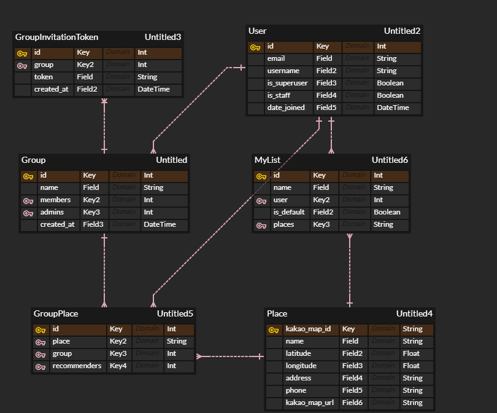

# Woochelin's guide

>너와 나의 맛집 지도!
>우슐랭가이드

[사이트 링크](https://woochelins-guide.netlify.app/)

[Frontend repository 링크](https://github.com/WoosubLeee/woochelins-guide-frontend)

## 1. 기획 배경

:question: 맛집 광고에 속은 적이 있으신가요?

:question: 단톡방에 맛집을 물어본 적 있으신가요?

:question: 입맛이 비슷한 친구의 추천 맛집이 궁금하신가요?

이런 분들을 위해 준비했습니다.
친구들과 함께 만드는 신뢰할 수 있는 맛집 지도 **우슐랭가이드** 입니다.

**우슐랭가이드** 에서는:

:point_right: 친구와 그룹을 만들어 맛집을 서로 추천하고

:point_right: 나만의 맛집 리스트도 만들고

:point_right: 맛집 정보를 조회할 수 있습니다.

## 2. ERD

## 3. 개발

### 3.1. 기술 스택

> Backend의 기술 스택만 담고 있습니다.

 version - 4.0.1

 version - 3.13.1

 version - 3

### 3.2. 개발자

  :raising_hand: **이우섭**

- GitHub - https://github.com/WoosubLeee
- Email - zbxv1423@naver.com

### 3.3. 향후 과제

- Authentication 방식 변경(현재 DRF token authentication 사용중)
- validation 고도화
- 예외 처리 고도화